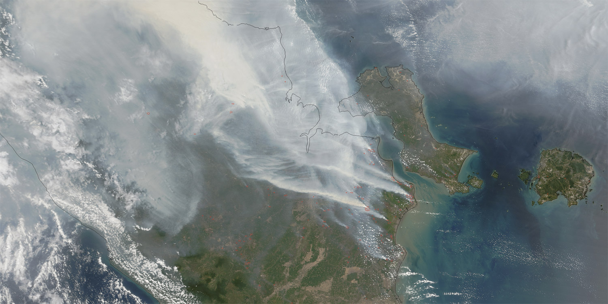
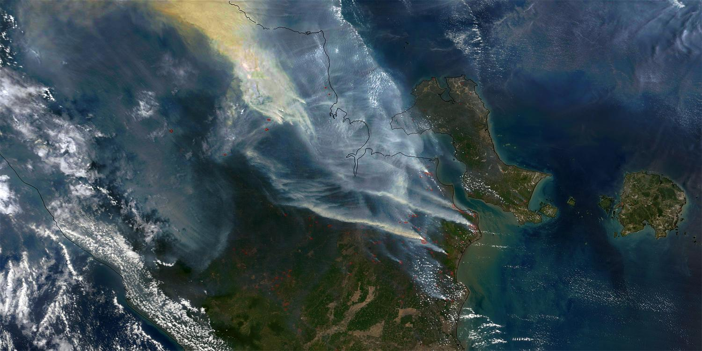

# Haze Removal

## Introduction

This is an simple implemention of "single image haze removal using dark channel prior" by kaiming He, which wins the CVPR09 best paper.

## Parameters by default
- radius=7
- omega=0.95
- t0=0.1
- r=60
- eps=0.001

## Dependencies

- numpy
- opencv-python
- scikit-image
- Pillow
- matplotlib
- numba
- tk

## Run
Run main.py file or to run using command line use:
```bash
git clone https://github.com/adityakm24/image-dehaze.git
cd image-dahaze
python main.py
```


## DEMO


<figure class="half">
    
    
</figure>


## References

- paper: Single Image Haze Removal using Dark Channel Prior
- paper: Guided Image Fltering
